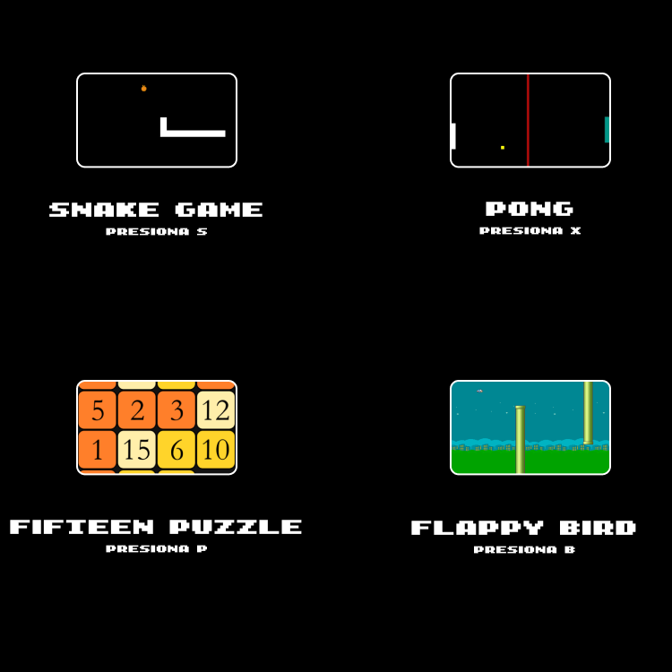
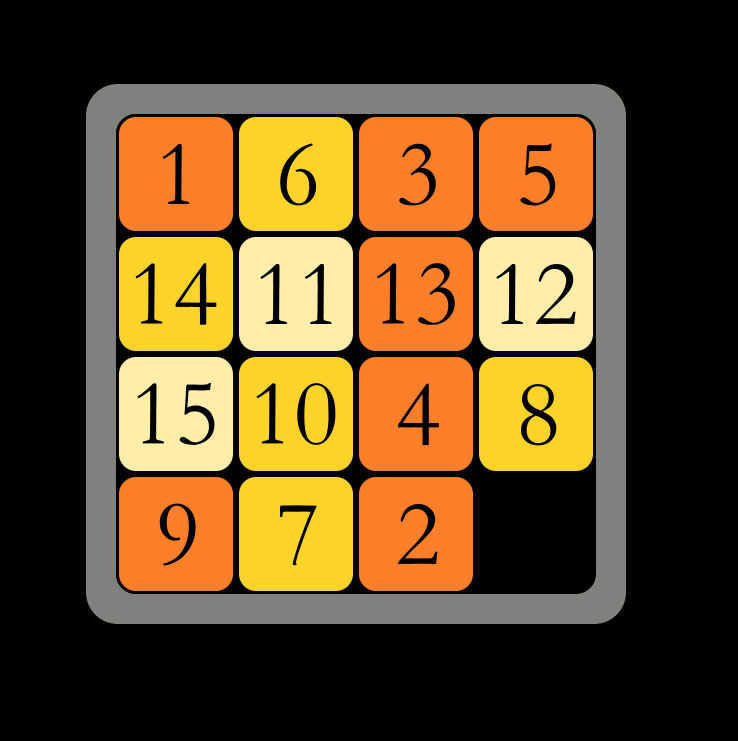
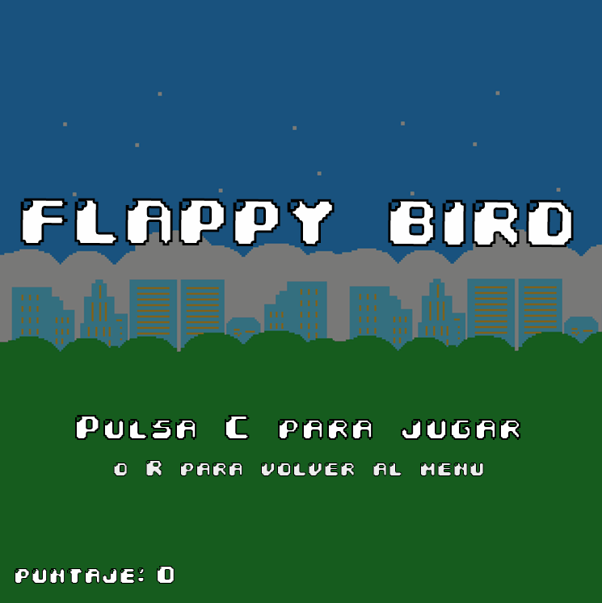
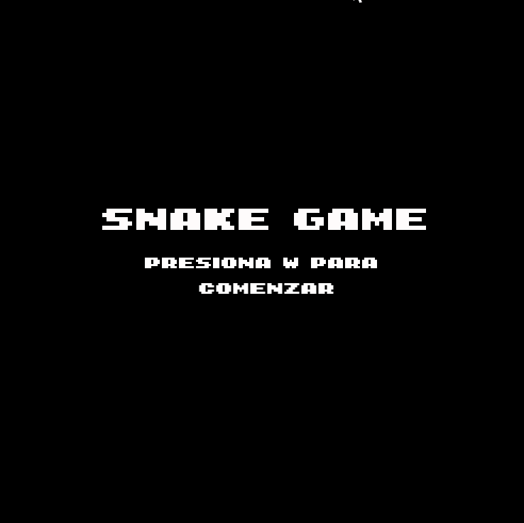

# ¡A jugar!

## Juegos realizados con la biblioteca Wollok Game

Esta sala de juegos le brinda no una, ni dos, ni tres, sino _cuatro_ opciones diversas para que el tiempo en su cuarentena pase un poco más armoniosamente. :shipit:

- ### Fifteen Puzzle  

- ### Flappy Bird  

- ### Snake  

- ### Pong

### Resumen de cada juego:

- ### Fifteen Puzzle  
Un tablero de 4x4 con quince piezas numeradas del 1 al 15 aparecen misteriosamente en desorden, y se pueden mover utilizando las flechas del teclado.  
El jugador gana cuando las logra ordenar ascendentemente.

- ### Flappy Bird  
Un ave vuela libre por su vida, pero el universo (¿quizás Dan Ingalls?) no hace más que ponerle tuberías como obstáculos.

Solamente podrá sobrevivir si el jugador es lo suficientemente diestro con la barra espaciadora.

- ### Snake  

La serpiente Python tiene mucha hambre pero, para su fortuna, vive en un cuadrilátero en el que aparece comida mágicamente (algunas de origen dudoso...!) cada vez que come.  

Desafortunadamente, su gula la llevará a un trágico destino... La autofagia.  
Eso, claro está, si el jugador no tiene la suficiente habilidad con las teclas WASD como para salvar a Python.

- ### Pong

En este universo de locos, también hay un lugar en el que dos Raquetas se mueven para evitar que una pelota se les vaya. ¿Quién puso la pelota ahí? Nadie lo sabe. ¿Cómo puede ser que la Raqueta verde ande sola? Es magia. ¿Qué me queda a mí? Jugar al pong (con las teclas K y M para subir o bajar la raqueta, respectivamente).

### Instrucciones:

Para comenzar lo que serán (sin duda) horas de entretenimiento sin fin, el primer paso es ejecutar el programa `main.wpgm` en el querido IDE de Wollok.  
Allí se presentarán las cuatro opciones: Snake, Fifteen Puzzle, Flappy Bird y Pong con sus respectivos comandos para comenzar a jugar con cada uno.

Después de pasar una, o dos horas con el primer juego (o, en su defecto, con cada derrota que el jugador enfrente), se tendrá la opción de reiniciar el juego o volver al menú principal tocando la tecla `R`.

Para exprimir la diversión al extremo, aconsejamos repetir este proceso de forma indefinida hasta que termine el aislamiento social.

### Acerca de:

Autores:
- Cristóbal Szkutnik
- Guido Dipietro
- Pablo Ayala
- Pablo Pellegrini

Docente / Curso / Institución:
- Lucas Spigariol - asistido por Marcos Rivitti
- K2002 Paradigmas de Programación
- UTN FRBA

Versión de Wollok: 2.0.1

Fecha: Octubre de 2020

[Guía de herramientas](https://www.wollok.org/documentacion/conceptos/)
